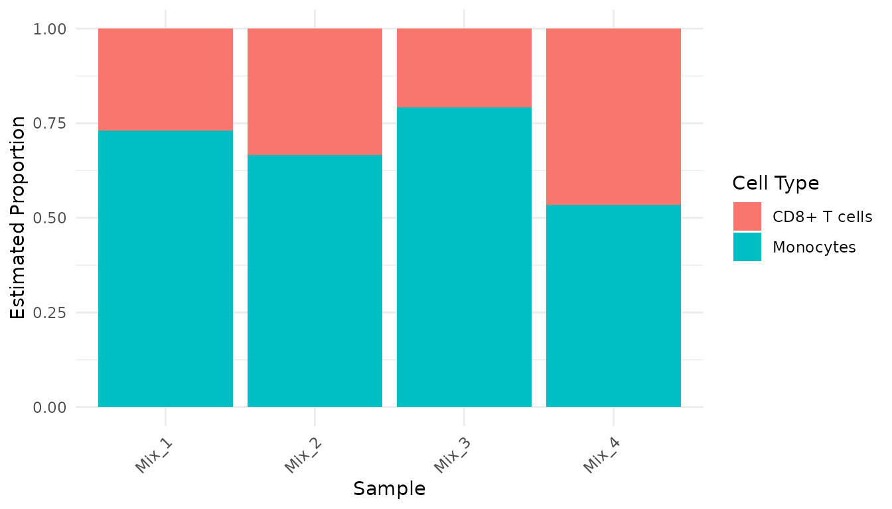

# Introduction to proteoDeconv

## Introduction

This vignette describes a basic workflow that can be used to run the
proteoDeconv package.

## Loading required packages

First, let’s load the necessary packages:

``` r
library(proteoDeconv)
library(readr)
library(dplyr)
library(tidyr)
library(ggplot2)
```

## Example data overview

`proteoDeconv` includes two example datasets, which are subsets of our
dataset PXD056050:

1.  Pure cell type samples: Proteomic measurements from isolated CD8+ T
    cells and monocytes.
2.  Mixed samples: Proteomic data from experimental mixtures containing
    50% CD8+ T cells and 50% monocytes.

Let’s load these datasets:

``` r
pure_data_file <- system.file("extdata", "pure_samples_matrix.rds", package = "proteoDeconv")
pure_samples <- readRDS(pure_data_file)

mix_data_file <- system.file("extdata", "mixed_samples_matrix.rds", package = "proteoDeconv")
mixed_samples <- readRDS(mix_data_file)
```

Let’s examine the structure of the pure samples data:

``` r
dim(pure_samples)
#> [1] 3317    8

head(pure_samples)
#>                            CD8+ T cells_1 CD8+ T cells_2 CD8+ T cells_3
#> IGKV3-15;IGKV3-7;IGKV3D-7              NA         799607       158030.0
#> IGLV3-16;IGLV3-25;IGLV3-27             NA             NA             NA
#> IGKV3-11;IGKV3D-11                     NA         230449        41679.4
#> IGHV3OR16-9                            NA         151730        41122.8
#> GATD3;GATD3B                      2297760        2768020      3160440.0
#> IGKV1-13;IGKV1D-13                     NA             NA             NA
#>                            CD8+ T cells_5 Monocytes_1 Monocytes_2 Monocytes_3
#> IGKV3-15;IGKV3-7;IGKV3D-7          477644      213180          NA      149232
#> IGLV3-16;IGLV3-25;IGLV3-27             NA          NA          NA          NA
#> IGKV3-11;IGKV3D-11                 150046          NA          NA          NA
#> IGHV3OR16-9                            NA          NA          NA          NA
#> GATD3;GATD3B                      2765990     1864430     1859990     1653820
#> IGKV1-13;IGKV1D-13                     NA          NA          NA          NA
#>                            Monocytes_4
#> IGKV3-15;IGKV3-7;IGKV3D-7           NA
#> IGLV3-16;IGLV3-25;IGLV3-27          NA
#> IGKV3-11;IGKV3D-11                  NA
#> IGHV3OR16-9                         NA
#> GATD3;GATD3B                   1906570
#> IGKV1-13;IGKV1D-13                  NA
```

The data matrix contains protein measurements (rows) across different
samples (columns). The sample names indicate the cell type (CD8 for CD8+
T cells and Mono for monocytes).

## Data preprocessing

Proper preprocessing is important for accurate deconvolution. The
preprocessing pipeline in `proteoDeconv` includes several important
steps:

``` r
pure_samples_preprocessed <- pure_samples |>
  # Extract first gene group when multiple gene groups are present
  extract_identifiers() |>
  # Update gene symbols to current HGNC nomenclature
  update_gene_symbols() |>
  # Handle missing values by imputing with the lowest observed value
  handle_missing_values() |>
  # Resolve duplicate genes by keeping the row with highest median value
  handle_duplicates() |>
  # Scale the data (TPM-like normalization)
  convert_to_tpm()

# Apply the same preprocessing to mixed samples
mixed_samples_preprocessed <- mixed_samples |>
  extract_identifiers() |>
  update_gene_symbols() |>
  handle_missing_values() |>
  handle_duplicates() |>
  convert_to_tpm()
```

Let’s examine the preprocessed data:

``` r
head(pure_samples_preprocessed)
#>             CD8+ T cells_1 CD8+ T cells_2 CD8+ T cells_3 CD8+ T cells_5
#> IGKV3-15        0.08027906    19.66485501      8.2758047     22.9537904
#> IGLV3-16        0.08027906     0.06133261      0.1306014      0.1198471
#> IGKV3-11        0.08027906     5.66746686      2.1826905      7.2106515
#> IGHV3OR16-9     0.08027906     3.73151867      2.1535421      0.1198471
#> GATD3          73.96557868    68.07433147    165.5077151    132.9231702
#> IGKV1-13        0.08027906     0.06133261      0.1306014      0.1198471
#>             Monocytes_1 Monocytes_2 Monocytes_3 Monocytes_4
#> IGKV3-15      13.462733   0.1468999   9.8914941   0.1450565
#> IGLV3-16       0.157494   0.1468999   0.1653017   0.1450565
#> IGKV3-11       0.157494   0.1468999   0.1653017   0.1450565
#> IGHV3OR16-9    0.157494   0.1468999   0.1653017   0.1450565
#> GATD3        117.742395 109.5607297 109.6195913 110.8951904
#> IGKV1-13       0.157494   0.1468999   0.1653017   0.1450565
```

### Preprocessing options

`proteoDeconv` offers several options for each preprocessing step, which
have been evaluated for their impact on deconvolution performance. For
further information on the options, please refer to the [function
reference](https://computationalproteomics.github.io/proteoDeconv/reference/index.html).

## Creating a signature matrix

A signature matrix contains cell type-specific marker proteins that will
be used for the deconvolution. Signature matrices represent the
reference profiles of pure cell populations.

To create one, we first need to establish which samples correspond to
which cell types:

``` r
mapping_rules <- list(
  "CD8+ T cells" = "CD8", # Samples containing "CD8" will be classified as CD8+ T cells
  "Monocytes" = "Mono" # Samples containing "Mono" will be classified as Monocytes
)

phenoclasses <- create_phenoclasses(
  pure_samples_preprocessed,
  mapping_rules,
  verbose = TRUE
)
#> Using regex-based mapping rules
#> Mapping to 'CD8+ T cells': CD8+ T cells_1, CD8+ T cells_2, CD8+ T cells_3, CD8+ T cells_5
#> Mapping to 'Monocytes': Monocytes_1, Monocytes_2, Monocytes_3, Monocytes_4

head(phenoclasses)
#> # A tibble: 2 × 9
#>   cell_type  `CD8+ T cells_1` `CD8+ T cells_2` `CD8+ T cells_3` `CD8+ T cells_5`
#>   <chr>                 <dbl>            <dbl>            <dbl>            <dbl>
#> 1 CD8+ T ce…                1                1                1                1
#> 2 Monocytes                 2                2                2                2
#> # ℹ 4 more variables: Monocytes_1 <dbl>, Monocytes_2 <dbl>, Monocytes_3 <dbl>,
#> #   Monocytes_4 <dbl>
```

The phenoclasses matrix shows which cell type each sample represents,
which is required for the signature matrix generation.

Now, we can create the signature matrix using CIBERSORTx:

``` r
# Note: This requires a CIBERSORTx token to be set in .Renviron
signature_matrix <- create_signature_matrix(
  refsample = pure_samples_preprocessed,
  phenoclasses = phenoclasses,
  g_min = 200,
  g_max = 400,
  q_value = 0.01
)
```

Let’s examine the signature matrix:

``` r
dim(signature_matrix)
#> [1] 426   2

# Look at the first rows
head(signature_matrix)
#>        CD8+ T cells  Monocytes
#> ABCB6    77.6657360 353.951727
#> ABI3     34.3210650   0.152197
#> ABLIM1   12.5659965   0.152197
#> ACAA1     0.1000631   3.507357
#> ACADVL   55.3678625 222.706106
#> ACSL3     2.3622472  14.178111
```

The signature matrix contains proteins (rows) with their expression
values in each cell type (columns). These proteins were selected based
on their ability to differentiate between CD8+ T cells and monocytes.

## Performing deconvolution

Now we can deconvolute our mixed samples to estimate their cell type
composition. The `proteoDeconv` package supports multiple algorithms
that have been evaluated for their performance with proteomics data.
We’ll use the EPIC algorithm here (Racle et al. 2017):

``` r
results <- deconvolute(
  algorithm = "epic",
  data = mixed_samples_preprocessed,
  signature = signature_matrix,
  with_other_cells = FALSE # No need to calculate other cells in this case
)

print(results)
#>       CD8+ T cells Monocytes
#> Mix_1    0.2691316 0.7308684
#> Mix_2    0.3341222 0.6658778
#> Mix_3    0.2074690 0.7925310
#> Mix_4    0.4650601 0.5349399
```

The results show the estimated proportion of each cell type in each
mixed sample.

### Available deconvolution algorithms

`proteoDeconv` supports multiple deconvolution algorithms:

- **EPIC** (Racle et al. 2017): A reference-based method that uses
  constrained least-squares regression
- **CIBERSORT** (Newman et al. 2015): One of the first widely-used
  deconvolution tools, uses support vector regression (requires
  downloading the CIBERSORT.R script from the CIBERSORT website)
- **CIBERSORTx** (Newman et al. 2019): An enhanced version of CIBERSORT
  that includes batch correction features (requires a token and Docker)
- **BayesDeBulk** (Petralia et al. 2023): A Bayesian approach
  specifically designed for proteomics deconvolution

To use a different algorithm, simply change the `algorithm` parameter:

``` r
# Example using a different algorithm
results_cibersort <- deconvolute(
  algorithm = "cibersort",
  data = mixed_samples_preprocessed,
  signature = signature_matrix
)
```

## Formatting and visualizing results

For easier visualization, let’s convert the results to a tidy format:

``` r
results_tidy <- as_tibble(results, rownames = "sample") |>
  pivot_longer(
    cols = -sample,
    names_to = "cell_type",
    values_to = "cell_fraction"
  )

head(results_tidy)
#> # A tibble: 6 × 3
#>   sample cell_type    cell_fraction
#>   <chr>  <chr>                <dbl>
#> 1 Mix_1  CD8+ T cells         0.269
#> 2 Mix_1  Monocytes            0.731
#> 3 Mix_2  CD8+ T cells         0.334
#> 4 Mix_2  Monocytes            0.666
#> 5 Mix_3  CD8+ T cells         0.207
#> 6 Mix_3  Monocytes            0.793
```

Now, let’s create a bar chart to visualize the cell type proportions:

``` r
ggplot(results_tidy, aes(x = sample, y = cell_fraction, fill = cell_type)) +
  geom_bar(stat = "identity", position = "stack") +
  theme_minimal() +
  theme(axis.text.x = element_text(angle = 45, hjust = 1)) +
  labs(
    x = "Sample",
    y = "Estimated Proportion",
    fill = "Cell Type"
  )
```



## Conclusion

This vignette demonstrated the basic workflow for proteomics
deconvolution using the `proteoDeconv` package:

1.  Load and preprocess your data
2.  Create a cell type signature matrix
3.  Perform deconvolution on mixed samples
4.  Visualize and interpret the results

For more advanced usage, refer to the package documentation and
[function
reference](https://computationalproteomics.github.io/proteoDeconv/reference/index.html).

## References

Newman, Aaron M., Chih Long Liu, Michael R. Green, Andrew J. Gentles,
Weiguo Feng, Yue Xu, Chuong D. Hoang, Maximilian Diehn, and Ash A.
Alizadeh. 2015. “Robust Enumeration of Cell Subsets from Tissue
Expression Profiles.” *Nature Methods* 12 (5): 453–57.
<https://doi.org/10.1038/nmeth.3337>.

Newman, Aaron M., Chloé B. Steen, Chih Long Liu, Andrew J. Gentles,
Aadel A. Chaudhuri, Florian Scherer, Michael S. Khodadoust, et al. 2019.
“Determining Cell Type Abundance and Expression from Bulk Tissues with
Digital Cytometry.” *Nature Biotechnology* 37 (7): 773–82.
<https://doi.org/10.1038/s41587-019-0114-2>.

Petralia, Francesca, Azra Krek, Anna P. Calinawan, Daniel Charytonowicz,
Robert Sebra, Song Feng, Sara Gosline, et al. 2023. “BayesDeBulk: A
Flexible Bayesian Algorithm for the Deconvolution of Bulk Tumor Data.”
bioRxiv. <https://doi.org/10.1101/2021.06.25.449763>.

Racle, Julien, Kaat de Jonge, Petra Baumgaertner, Daniel E Speiser, and
David Gfeller. 2017. “Simultaneous Enumeration of Cancer and Immune Cell
Types from Bulk Tumor Gene Expression Data.” Edited by Alfonso Valencia.
*eLife* 6 (November): e26476. <https://doi.org/10.7554/eLife.26476>.
